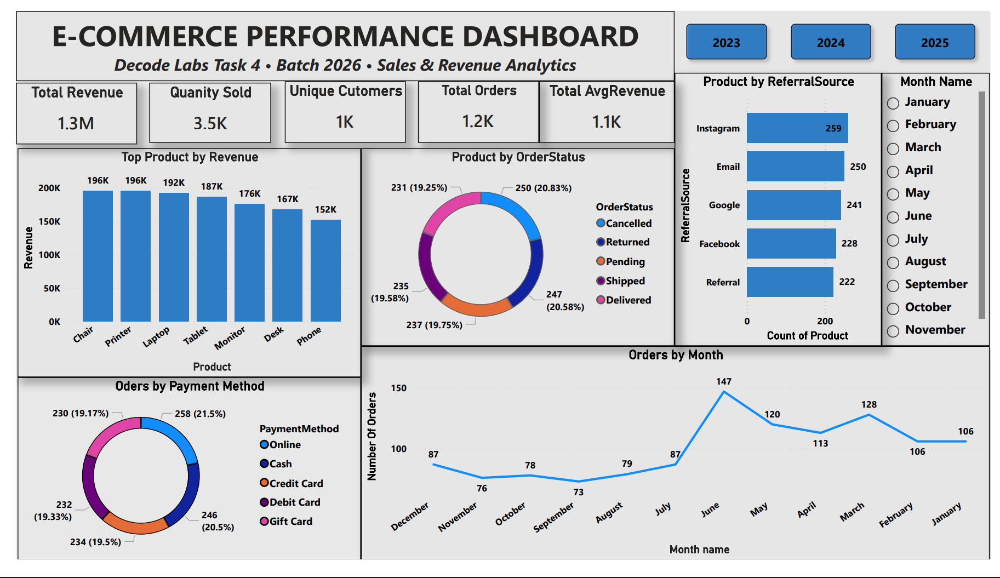
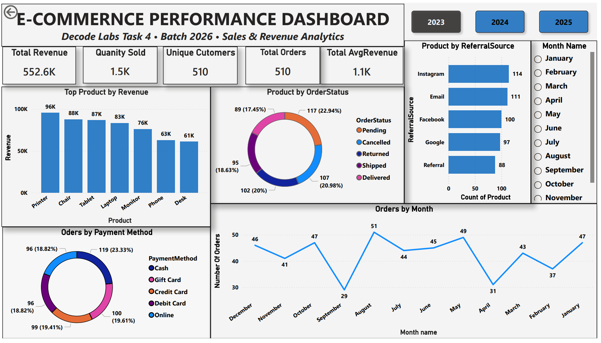
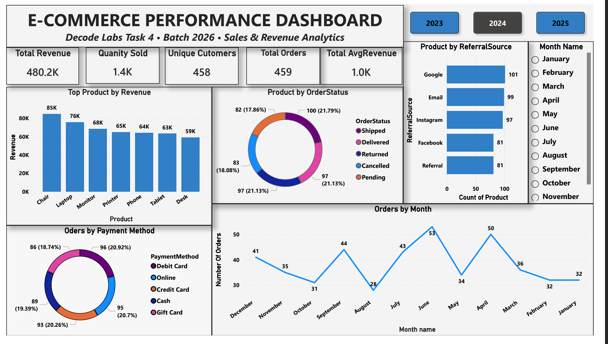
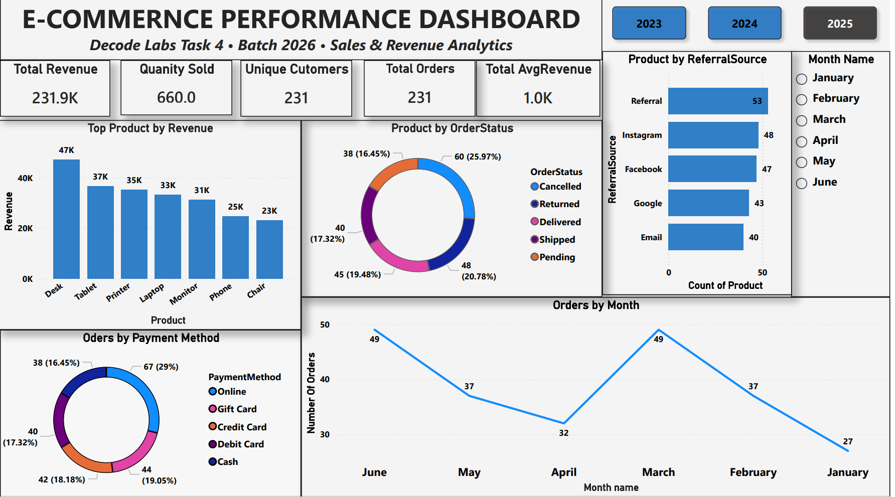

# Decode Labs Project 4: Power BI Sales & Revenue Analytics Dashboard

## Project Overview

This project focuses on building an interactive Power BI dashboard to analyze e-commerce sales performance and provide actionable business insights. The dashboard was developed as part of the Decode Labs Data Analytics Internship and serves as the final stage of the analytics workflow, following data cleaning, exploratory data analysis (EDA), and SQL analysis.

The dashboard enables stakeholders to monitor revenue performance, customer behavior, product trends, referral channel effectiveness, payment preferences, and order status distribution through interactive visualizations and KPI tracking.

---

## Business Problem

Businesses generate large volumes of transactional data daily, making it difficult to identify trends and make informed decisions without proper analysis.

The objective of this project was to transform raw sales data into a visually engaging dashboard that provides decision-makers with a clear understanding of:

- Revenue performance
- Product profitability
- Customer purchasing behavior
- Referral source effectiveness
- Payment method preferences
- Monthly sales trends
- Order status distribution

---

## Dashboard Objectives

The dashboard was designed to:

- Monitor overall business performance.
- Track revenue and sales trends.
- Identify top-performing products.
- Analyze customer acquisition channels.
- Evaluate payment method usage.
- Monitor order status distribution.
- Support data-driven decision-making.

---

## Dataset Overview

The dataset contains approximately **1,200 e-commerce transactions** and includes:

- Order ID
- Order Date
- Customer ID
- Product
- Quantity
- Unit Price
- Payment Method
- Order Status
- Coupon Code
- Referral Source
- Total Price

---

## Dashboard Features

The dashboard includes:

### KPI Cards

- Total Revenue
- Quantity Sold
- Unique Customers
- Total Orders
- Average Revenue per Order

### Interactive Filters

- Year Selection (2023, 2024, 2025)
- Month Selection

### Visualizations

- Revenue by Product
- Orders by Month
- Orders by Payment Method
- Orders by Order Status
- Product Distribution by Referral Source

---

## Key Performance Indicators (KPIs)

| KPI | Value |
|------|------|
| Total Revenue | $1.3M |
| Total Orders | 1,200 |
| Quantity Sold | 3,500+ |
| Unique Customers | 1,000+ |
| Average Revenue per Order | $1.1K |

---

## Dashboard Screenshots

### Overall Dashboard

### Dashboard - 2023

### Dashboard - 2024

### Dashboard - 2025

## Project Files

[Power BI Dashboard File](decode_labs_ecommerce_dashboard.pbix)

---

## Key Insights

### Revenue Performance

- The business generated over **$1.3 million** in total revenue.
- Average revenue per order exceeded **$1,000**, indicating strong customer spending.

### Product Performance

- Chairs generated the highest overall revenue.
- Printers and Laptops consistently ranked among the top-performing products.
- Phones generated the lowest overall revenue.

### Customer Acquisition

- Instagram was the strongest referral source.
- Email and Google also contributed significantly to customer acquisition.

### Payment Method Analysis

- Online payments were the most frequently used payment method.
- Payment preferences were relatively balanced across all payment options.

### Order Status Analysis

- Orders were distributed across multiple statuses.
- Cancelled orders accounted for a notable proportion of transactions and may require further investigation.

### Monthly Trends

- Order activity peaked during June.
- Lower order volumes were observed during August and September.

---

## Recommendations

- Increase marketing investment in Instagram due to its strong referral performance.
- Promote high-performing products such as Chairs, Printers, and Laptops.
- Investigate the causes of cancelled orders to improve customer satisfaction and operational efficiency.
- Implement targeted marketing campaigns during low-performing months.
- Monitor product performance regularly to support inventory planning and demand forecasting.
- Continue optimizing the online payment experience to align with customer preferences.

---

## Tools Used

- Microsoft Power BI
- Power Query
- DAX
- Microsoft Excel

---

## Conclusion

This project demonstrates the use of Power BI to transform transactional data into meaningful business insights. Through KPI tracking, interactive filtering, and visual analytics, the dashboard provides a comprehensive overview of business performance and supports data-driven decision-making.

The project highlights the value of business intelligence tools in identifying trends, evaluating performance, and uncovering opportunities for growth.
